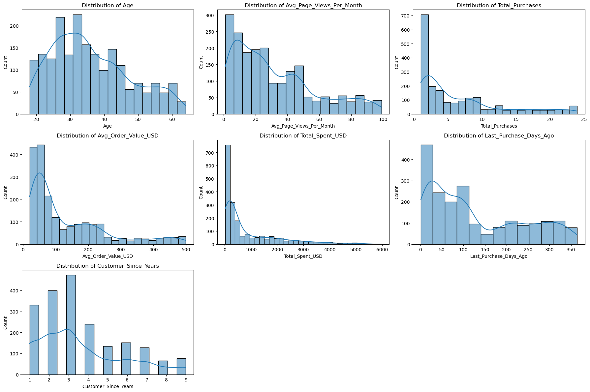

# Customer Segmentation Analysis for **ChicThreads Online**

This project focuses on performing a comprehensive customer segmentation for ChicThreads Online, an e-commerce fashion brand. By leveraging unsupervised machine learning (K-Means Clustering), the goal is to identify distinct customer groups based on their demographic information, shopping behaviors, and preferences. This segmentation aims to provide actionable insights for developing targeted marketing strategies, enhancing customer experience, and optimizing business growth.

# Problem Statement / Business Goal
ChicThreads Online aims to enhance its marketing effectiveness and customer engagement by moving beyond a one-size-fits-all approach. The key business objective is to understand the diverse nature of its customer base to enable personalized marketing campaigns, optimize product recommendations, and improve overall customer lifetime value. 
This analysis will identify natural groupings within the customer data to inform data-driven business decisions.

## 2. Data Source & Description

The analysis utilizes the `online_fashion_customer_data.csv` dataset, which contains 2000 customer records with various attributes.

**Key Features Include:**

| Column Name | Description |
|-------------|-------------|
| `CustomerID` | Unique identifier for each customer |
| `Age` | Customer's age |
| `Gender` | Customer's gender ('Male', 'Female', 'Other') |
| `Location_Region` | Geographic region ('North', 'South', 'East', 'West') |
| `Subscription_Status` | Whether the customer is a subscriber ('Yes', 'No') |
| `Avg_Page_Views_Per_Month` | Average number of web pages viewed per month |
| `Total_Purchases` | Total number of orders placed in the last year |
| `Avg_Order_Value_USD` | Average amount spent per order in USD |
| `Total_Spent_USD` | Total money spent in the last year |
| `Last_Purchase_Days_Ago` | Days since the last purchase |
| `Product_Category_Preference` | Preferred product category ('Casual Wear', 'Formal Wear', 'Sportswear', 'Accessories') |
| `Has_Used_Coupon` | Whether the customer has used a coupon ('Yes', 'No') |
| `Customer_Since_Years` | Number of years the customer has been a customer |

# Technologies & Libraries Used

* Python 3.x
* Pandas (for data manipulation and analysis)
* NumPy (for numerical operations)
* Scikit-learn (for K-Means clustering, `StandardScaler`, `OneHotEncoder`, `ColumnTransformer`, `silhouette_score`)
* Matplotlib (for data visualization)
* Seaborn (for enhanced data visualization)
* Jupyter Notebook (for interactive development and documentation)

# Methodology

The project follows a standard data science methodology:

### Data Loading & Initial Exploration
* Loaded the dataset into a Pandas DataFrame.
* Performed initial checks for missing values, data types, and basic descriptive statistics.
* Conducted exploratory data analysis (EDA) including distributions and correlations of key features (e.g., spending habits, age distribution, gender breakdown).

### Data Preparation
To prepare the data for clustering, the following steps were performed:
* **Feature Selection:** The `CustomerID` column was excluded as it's an identifier and not relevant for segmentation. All other demographic, behavioral, and preference features were used.
* **Categorical Encoding:** Categorical variables (`Gender`, `Location_Region`, `Subscription_Status`, `Product_Category_Preference`, `Has_Used_Coupon`) were converted into a numerical format using `OneHotEncoder`. This prevents the algorithm from assuming ordinal relationships.
* **Feature Scaling:** Numerical features (`Age`, `Avg_Page_Views_Per_Month`, `Total_Purchases`, `Avg_Order_Value_USD`, `Total_Spent_USD`, `Last_Purchase_Days_Ago`, `Customer_Since_Years`) were standardized using `StandardScaler`. This ensures that features with larger values do not disproportionately influence distance calculations in the clustering algorithm.

### K-Means Clustering
* The `K-Means` algorithm was chosen for its interpretability and effectiveness in creating distinct clusters.
* **Optimal Number of Clusters (K):** The Elbow Method (analyzing Within-Cluster Sum of Squares - WCSS) and Silhouette Score were used to determine the optimal 'K' for the dataset.
    * **Elbow Method:** The "elbow" appeared around K=3 or K=4, indicating diminishing returns in WCSS reduction beyond this point.
    * **Silhouette Score:** The score peaked at K=4, suggesting the best-defined clusters.
    * Based on these evaluations, **K=4** was selected as the optimal number of clusters.
* The `K-Means` algorithm was then applied with `n_clusters=4` to segment the customers.

### Exploration of Clusters
* After assigning a cluster label to each customer, the characteristics of each segment were thoroughly analyzed.
* **Numerical Features:** Mean values for each numerical feature were calculated per cluster to understand differences in age, spending, engagement, etc.
* **Categorical Features:** Percentage distributions for each categorical feature were analyzed per cluster to identify dominant preferences (e.g., product category, subscription status, coupon usage).

# Results: Customer Segment Profiles

The analysis identified four distinct customer segments:

### Cluster 0: "The Budget-Conscious Casual Shoppers" (703 Customers)
* **Age:** Predominantly younger customers (average 26.85 years).
* **Engagement & Spending:** Moderate page views, lower total purchases, very low average order value (\$44.65), and low total spending (\$241.74).
* **Activity:** Relatively active, with recent purchases (average 75.53 days ago).
* **Loyalty:** Newer customers (average 1.99 years).
* **Key Traits:** Not subscribers, strong preference for Casual Wear and Sportswear. Highly responsive to coupons (71.27% have used one). Located primarily in North and South regions.

**Persona:** These are younger, price-sensitive shoppers who are not yet loyal subscribers but are open to promotions. They engage moderately with the site and prefer everyday fashion and activewear.

### Cluster 1: "The High-Value Loyal Subscribers" (500 Customers)
* **Age:** Mid-range age (average 34.60 years).
* **Engagement & Spending:** Highest engagement (avg 68.56 page views), highest total purchases (avg 15.87), highest total spending (\$2505.98), and healthy average order value (\$159.36).
* **Activity:** Most active, with very recent purchases (average 15.95 days ago).
* **Loyalty:** Most loyal and long-term customers (average 6.12 years).
* **Key Traits:** All are subscribers. Strong preference for Formal Wear and Accessories. Very low coupon usage (only 13.80% have used one). Located primarily in East and West regions.

**Persona:** This is the most valuable segment – established, highly engaged, frequent, and high-spending customers who are loyal subscribers and prefer high-quality, more formal items. They are not driven by discounts.

### Cluster 2: "The Infrequent High-Ticket Buyers" (352 Customers)
* **Age:** Older customer base (average 48.27 years).
* **Engagement & Spending:** Very low page views and total purchases, but exceptionally high average order value (\$347.79) – the highest among all clusters. Moderate total spending (\$862.08) due to infrequent purchases.
* **Activity:** Least active in terms of recency (average 220.87 days since last purchase).
* **Loyalty:** Moderately loyal (average 4.49 years).
* **Key Traits:** Not subscribers. Strong preference for Formal Wear and Accessories. Very low coupon usage (only 10.51% have used one). Evenly distributed across all regions.

**Persona:** These are mature, high-net-worth individuals who purchase rarely but spend a significant amount when they do. They are not subscribers and are not motivated by coupons, likely seeking quality and specific high-value items.

### Cluster 3: "The Inactive & Low-Engagement Segment" (445 Customers)
* **Age:** Older customer base (average 42.74 years).
* **Engagement & Spending:** Lowest page views (avg 6.17), lowest total purchases (avg 1.54), lowest average order value (\$73.52), and lowest total spending (\$119.69).
* **Activity:** Least active, with very old last purchases (average 264.91 days ago).
* **Loyalty:** Lower loyalty (average 2.61 years).
* **Key Traits:** Not subscribers. Strong preference for Casual Wear and Sportswear. Extremely low coupon usage (only 0.67% have used one). Evenly distributed across all regions.
  
**Persona:** This segment represents older, highly inactive customers who have made very few, low-value purchases and show minimal engagement with the website or promotions. They are potentially churned or very low-potential customers.

# Visualizations

Key insights are further supported by the following visualizations:

### Distribution Analysis of Numerical Columns
 

### Product Category Preference Distribution by Cluster

* **Insight:** Clearly shows how product preferences differ significantly across segments, guiding targeted product promotions.

### Average Total Spent (USD) by Cluster

* **Insight:** Highlights the disproportionate value of Cluster 1 and 2 compared to others, indicating where revenue generation efforts should be focused.

### Distribution of Cluster Sizes

* **Insight:** Provides an understanding of the relative size of each customer segment, informing resource allocation.

