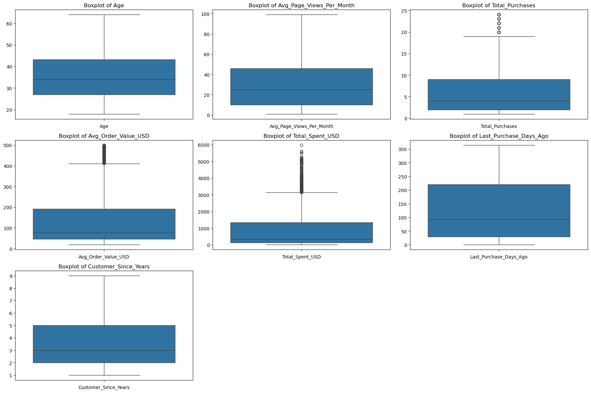
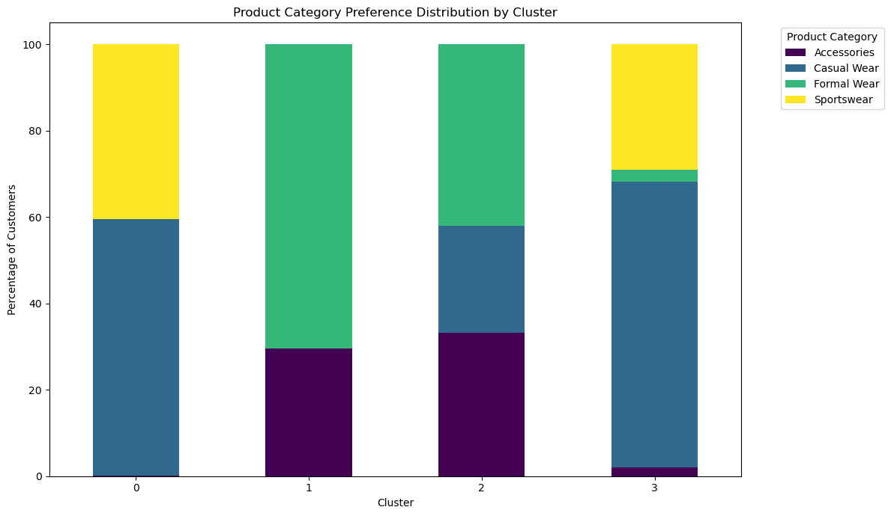
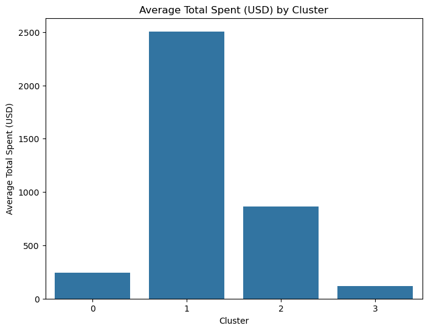
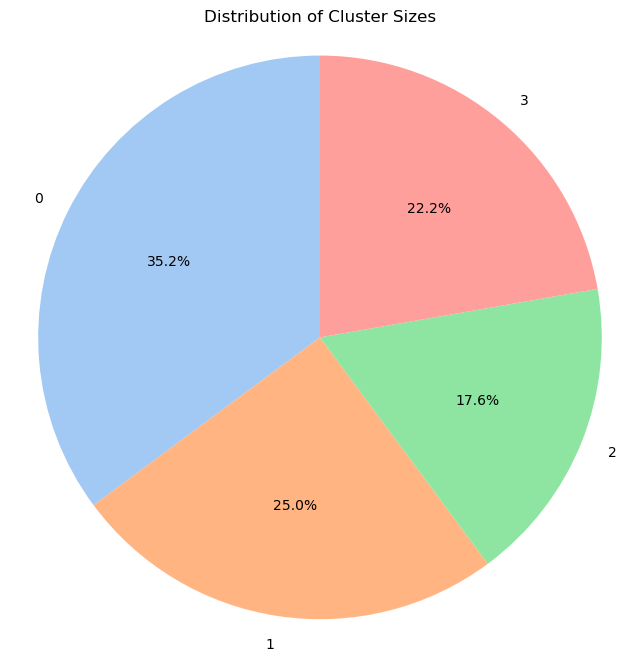

# Customer Segmentation Analysis for **ChicThreads Online**

This project focuses on performing a comprehensive customer segmentation for ChicThreads Online, an e-commerce fashion brand. By leveraging unsupervised machine learning (K-Means Clustering), the goal is to identify distinct customer groups based on their demographic information, shopping behaviors, and preferences. This segmentation aims to provide actionable insights for developing targeted marketing strategies, enhancing customer experience, and optimizing business growth.

# Problem Statement / Business Goal
ChicThreads Online aims to enhance its marketing effectiveness and customer engagement by moving beyond a one-size-fits-all approach. The key business objective is to understand the diverse nature of its customer base to enable personalized marketing campaigns, optimize product recommendations, and improve overall customer lifetime value. 
This analysis will identify natural groupings within the customer data to inform data-driven business decisions.

## 2. Data Source & Description

The analysis utilizes the `online_fashion_customer_data.csv` dataset, which contains 2000 customer records with various attributes.

**Key Features Include:**

| Column Name | Description |
|-------------|-------------|
| `CustomerID` | Unique identifier for each customer |
| `Age` | Customer's age |
| `Gender` | Customer's gender ('Male', 'Female', 'Other') |
| `Location_Region` | Geographic region ('North', 'South', 'East', 'West') |
| `Subscription_Status` | Whether the customer is a subscriber ('Yes', 'No') |
| `Avg_Page_Views_Per_Month` | Average number of web pages viewed per month |
| `Total_Purchases` | Total number of orders placed in the last year |
| `Avg_Order_Value_USD` | Average amount spent per order in USD |
| `Total_Spent_USD` | Total money spent in the last year |
| `Last_Purchase_Days_Ago` | Days since the last purchase |
| `Product_Category_Preference` | Preferred product category ('Casual Wear', 'Formal Wear', 'Sportswear', 'Accessories') |
| `Has_Used_Coupon` | Whether the customer has used a coupon ('Yes', 'No') |
| `Customer_Since_Years` | Number of years the customer has been a customer |

# Technologies & Libraries Used

* Python 3.x
* Pandas (for data manipulation and analysis)
* NumPy (for numerical operations)
* Scikit-learn (for K-Means clustering, `StandardScaler`, `OneHotEncoder`, `ColumnTransformer`, `silhouette_score`)
* Matplotlib (for data visualization)
* Seaborn (for enhanced data visualization)
* Jupyter Notebook (for interactive development and documentation)

# Methodology

The project follows a standard data science methodology:

### Data Loading & Initial Exploration
* Loaded the dataset into a Pandas DataFrame.
* Performed initial checks for missing values, data types, and basic descriptive statistics.
* Conducted exploratory data analysis (EDA) including distributions and correlations of key features (e.g., spending habits, age distribution, gender breakdown).

### Data Preparation
To prepare the data for clustering, the following steps were performed:
* **Feature Selection:** The `CustomerID` column was excluded as it's an identifier and not relevant for segmentation. All other demographic, behavioral, and preference features were used.
* **Categorical Encoding:** Categorical variables (`Gender`, `Location_Region`, `Subscription_Status`, `Product_Category_Preference`, `Has_Used_Coupon`) were converted into a numerical format using `OneHotEncoder`. This prevents the algorithm from assuming ordinal relationships.
* **Feature Scaling:** Numerical features (`Age`, `Avg_Page_Views_Per_Month`, `Total_Purchases`, `Avg_Order_Value_USD`, `Total_Spent_USD`, `Last_Purchase_Days_Ago`, `Customer_Since_Years`) were standardized using `StandardScaler`. This ensures that features with larger values do not disproportionately influence distance calculations in the clustering algorithm.

### K-Means Clustering
* The `K-Means` algorithm was chosen for its interpretability and effectiveness in creating distinct clusters.
* **Optimal Number of Clusters (K):** The Elbow Method (analyzing Within-Cluster Sum of Squares - WCSS) and Silhouette Score were used to determine the optimal 'K' for the dataset.
    * **Elbow Method:** The "elbow" appeared around K=3 or K=4, indicating diminishing returns in WCSS reduction beyond this point.
    * **Silhouette Score:** The score peaked at K=4, suggesting the best-defined clusters.
    * Based on these evaluations, **K=4** was selected as the optimal number of clusters.
* The `K-Means` algorithm was then applied with `n_clusters=4` to segment the customers.

### Exploration of Clusters
* After assigning a cluster label to each customer, the characteristics of each segment were thoroughly analyzed.
* **Numerical Features:** Mean values for each numerical feature were calculated per cluster to understand differences in age, spending, engagement, etc.
* **Categorical Features:** Percentage distributions for each categorical feature were analyzed per cluster to identify dominant preferences (e.g., product category, subscription status, coupon usage).

# Results: Customer Segment Profiles

The analysis identified four distinct customer segments:

### Cluster 0: "The Budget-Conscious Casual Shoppers" (703 Customers)
* **Age:** Predominantly younger customers (average 26.85 years).
* **Engagement & Spending:** Moderate page views, lower total purchases, very low average order value (\$44.65), and low total spending (\$241.74).
* **Activity:** Relatively active, with recent purchases (average 75.53 days ago).
* **Loyalty:** Newer customers (average 1.99 years).
* **Key Traits:** Not subscribers, strong preference for Casual Wear and Sportswear. Highly responsive to coupons (71.27% have used one). Located primarily in North and South regions.

**Persona:** These are younger, price-sensitive shoppers who are not yet loyal subscribers but are open to promotions. They engage moderately with the site and prefer everyday fashion and activewear.

### Cluster 1: "The High-Value Loyal Subscribers" (500 Customers)
* **Age:** Mid-range age (average 34.60 years).
* **Engagement & Spending:** Highest engagement (avg 68.56 page views), highest total purchases (avg 15.87), highest total spending (\$2505.98), and healthy average order value (\$159.36).
* **Activity:** Most active, with very recent purchases (average 15.95 days ago).
* **Loyalty:** Most loyal and long-term customers (average 6.12 years).
* **Key Traits:** All are subscribers. Strong preference for Formal Wear and Accessories. Very low coupon usage (only 13.80% have used one). Located primarily in East and West regions.

**Persona:** This is the most valuable segment – established, highly engaged, frequent, and high-spending customers who are loyal subscribers and prefer high-quality, more formal items. They are not driven by discounts.

### Cluster 2: "The Infrequent High-Ticket Buyers" (352 Customers)
* **Age:** Older customer base (average 48.27 years).
* **Engagement & Spending:** Very low page views and total purchases, but exceptionally high average order value (\$347.79) – the highest among all clusters. Moderate total spending (\$862.08) due to infrequent purchases.
* **Activity:** Least active in terms of recency (average 220.87 days since last purchase).
* **Loyalty:** Moderately loyal (average 4.49 years).
* **Key Traits:** Not subscribers. Strong preference for Formal Wear and Accessories. Very low coupon usage (only 10.51% have used one). Evenly distributed across all regions.

**Persona:** These are mature, high-net-worth individuals who purchase rarely but spend a significant amount when they do. They are not subscribers and are not motivated by coupons, likely seeking quality and specific high-value items.

### Cluster 3: "The Inactive & Low-Engagement Segment" (445 Customers)
* **Age:** Older customer base (average 42.74 years).
* **Engagement & Spending:** Lowest page views (avg 6.17), lowest total purchases (avg 1.54), lowest average order value (\$73.52), and lowest total spending (\$119.69).
* **Activity:** Least active, with very old last purchases (average 264.91 days ago).
* **Loyalty:** Lower loyalty (average 2.61 years).
* **Key Traits:** Not subscribers. Strong preference for Casual Wear and Sportswear. Extremely low coupon usage (only 0.67% have used one). Evenly distributed across all regions.
  
**Persona:** This segment represents older, highly inactive customers who have made very few, low-value purchases and show minimal engagement with the website or promotions. They are potentially churned or very low-potential customers.

# Visualizations

Key insights are further supported by the following visualizations:

### Distribution Analysis of Numerical Columns
 

**Age:** The distribution is approximately normal, with most customers falling within the 20 to 45 age range. This suggests a relatively young to middle-aged customer base.

**Avg_Page_Views_Per_Month:** This distribution is right-skewed, indicating that a large portion of customers visit only a few pages per month, while a smaller group exhibits higher engagement. The box plot for Avg_Page_Views_Per_Month does not show explicit outliers; instead, its upper whisker extends to the maximum value, indicating a wide range of engagement without individual data points being significantly detached from the main distribution.

**Total_Purchases:** This distribution is right-skewed, and the box plot clearly indicates several outliers at the higher end, representing customers with a significantly larger number of purchases compared to the majority.

**Avg_Order_Value_USD:** This distribution is right-skewed, and the box plot shows a number of outliers at the higher end, signifying customers who make exceptionally high-value orders.

**Total_Spent_USD:** Highly right-skewed, and the box plot demonstrates numerous outliers at the upper end, confirming the presence of high-value spenders who contribute a disproportionately large amount to total revenue. This is a common pattern in retail, often referred to as the "Pareto Principle" (80/20 rule).

**Last_Purchase_Days_Ago:** This distribution is also right-skewed. Many customers have made a recent purchase (fewer days ago), indicating a healthy base of active shoppers. However, there's a tail of customers who haven't purchased in a longer time, potentially indicating inactive or churning customers. The box plot shows some outliers on the higher end, meaning there are customers whose last purchase was a significantly longer time ago than most.

**Customer_Since_Years:** This distribution is right-skewed, suggesting a higher proportion of newer customers, with fewer long-term customers. The box plot does not show significant outliers; the data spreads out more towards the higher end without distinct detached points.

### Product Category Preference Distribution by Cluster

* **Insight:** Clearly shows how product preferences differ significantly across segments, guiding targeted product promotions.

### Average Total Spent (USD) by Cluster

* **Insight:** Highlights the disproportionate value of Cluster 1 and 2 compared to others, indicating where revenue generation efforts should be focused.

### Distribution of Cluster Sizes

* **Insight:** Provides an understanding of the relative size of each customer segment, informing resource allocation.

# Recommendations & Actionable Insights

The identified customer segments provide a robust framework for ChicThreads Online to implement highly personalized and effective strategies:

### For Cluster 0: "The Budget-Conscious Casual Shoppers"
* **Marketing Strategy:** Focus heavily on promotions, discounts, and flash sales. Implement tiered loyalty programs that reward early engagement.
* **Product Focus:** Feature `Casual Wear` and `Sportswear` prominently in campaigns targeted at this group.
* **Engagement:** Encourage repeat purchases through personalized recommendations based on past Browse/purchase history. Consider "buy-one-get-one-free" or percentage-off deals.
* **Subscription Push:** Offer attractive first-time subscriber discounts to convert them into loyal customers. Highlight the benefits of subscribing (e.g., early access to sales, exclusive content).

### For Cluster 1: "The High-Value Loyal Subscribers"
* **Marketing Strategy:** Emphasize exclusivity, new arrivals, and premium collections. Avoid excessive discounts as they are not price-sensitive. Focus on VIP experiences and early access.
* **Product Focus:** Highlight `Formal Wear` and `Accessories`. Curate personalized collections of high-end items.
* **Engagement:** Strengthen loyalty through exclusive subscriber-only content, personal stylists, or premium customer service. Recognize and reward their loyalty with milestone gifts or tiered benefits.
* **Retention:** Implement proactive retention strategies. For example, personalized thank-you notes or surveys to understand their continued satisfaction.

### For Cluster 2: "The Infrequent High-Ticket Buyers"
* **Marketing Strategy:** Focus on showcasing premium, high-quality, and limited-edition items. Use sophisticated imagery and storytelling.
* **Product Focus:** Strongly feature `Formal Wear` and `Accessories`. These customers are willing to spend more per item.
* **Engagement:** Since they visit infrequently, engage them through channels like email newsletters with new collection highlights, lookbooks, or exclusive event invitations rather than frequent promotional emails.
* **Conversion:** Offer personalized recommendations based on their high average order value. Perhaps suggest complementary high-value items to their previous large purchases.

### For Cluster 3: "The Inactive & Low-Engagement Segment"
* **Marketing Strategy:** This is a challenging group. Start with re-engagement campaigns focused on very attractive offers or highlighting significant new product lines. Test different channels beyond email, like social media ads or direct mail, if cost-effective.
* **Product Focus:** Offer basic `Casual Wear` or `Sportswear` bundles at highly competitive prices to encourage a first (or re-) purchase.
* **Engagement:** Acknowledge their long absence. Send "we miss you" emails with a strong incentive. Set realistic expectations for re-engagement.
* **Customer Win-Back:** If re-engagement attempts are unsuccessful, reduce marketing spend on this segment to optimize resources.

# Opportunities for Further Analysis

Customer segmentation is an iterative process. Here are some opportunities to further enhance this analysis and derive deeper insights:

* **Customer Lifetime Value (CLTV) Prediction:** Integrate CLTV calculations into the segmentation to understand the future value of each segment more accurately.
* **Churn Prediction:** Develop a model to predict which customers are at risk of churning, especially within the less active segments.
* **Sales Channel Analysis:** Investigate if there are distinct segment preferences for different sales channels (e.g., website, mobile app, physical store if applicable).
* **Response to Campaigns:** Track the effectiveness of targeted marketing campaigns on each segment to refine strategies.
* **Dynamic Segmentation:** Explore more advanced clustering techniques or dynamic segmentation models that adapt as customer behavior evolves over time.
* **A/B Testing:** Design and execute A/B tests on marketing campaigns, website features, and product recommendations tailored to specific segments to measure impact.
* **Demographic Enrichment:** If possible, enrich the dataset with more detailed demographic information (e.g., income, education, marital status) to create even richer customer profiles.
* **Temporal Analysis:** Analyze how customer behavior within segments changes over seasons, holidays, or major sales events.

# Contact & Credits

* **Author:** Ogbu Doris Chisom
* **Linkedin:** https://www.linkedin.com/in/dorischisom
* **Email:** dorisogbu16@gmail.com
* **GitHub:** https://github.com/Dorischisom

Feel free to connect with me if you have any questions or feedback!
