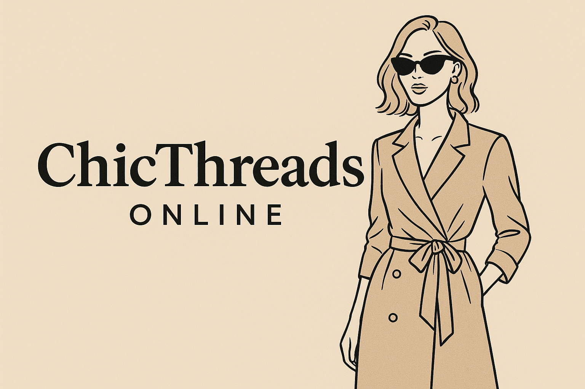

# Customer Segmentation Analysis for ChicThreads Online

This project focuses on performing a comprehensive customer segmentation for ChicThreads Online, an e-commerce fashion brand. By leveraging unsupervised machine learning (K-Means Clustering), the goal is to identify distinct customer groups based on their demographic information, shopping behaviors, and preferences. This segmentation aims to provide actionable insights for developing targeted marketing strategies, enhancing customer experience, and optimizing business growth.

# Problem Statement / Business Goal
